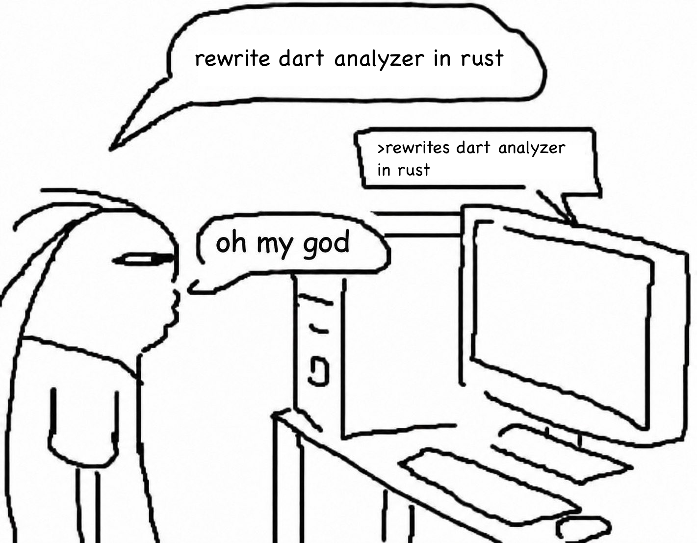

# dartr



dartr is a port of the Dart analyzer to Rust. The reference version is the
Dart SDK **3.13.3**. It is one native binary with these commands:

- `dartr analyze`: the same diagnostics as `dart analyze` (errors, warnings,
  lints, analyzer plugins), with the same options, output formats and exit codes.
- `dartr format`: a port of `dart_style` (`dart format`).
- `dartr language-server`: an LSP server. Dart-Code (VS Code) starts it through a
  small shim; other editors can start it directly.
- `dartr analysis-server` or `--protocol=analyzer`: the legacy analysis server
  protocol (partial).

The aim is the same output as the Dart tools, produced faster. Correctness is
checked by comparing dartr with the real Dart analyzer on large corpora (Dart
SDK tests, Flutter, `analyzer`, a 1.5 million line application).

## Status

| Area | State |
|---|---|
| Scanner, parser, AST | At parity (token, event and AST dumps match the Dart analyzer on the corpora) |
| Element model, types, resolution, constants | At parity on Flutter, `flutter_tools` and `analyzer` |
| Error and warning verifiers | At parity on the SDK tests (a few known differences) |
| Lints | All rules ported; compared with `dart analyze` on the corpora |
| `dartr analyze` | Same options, formats and exit codes as `dart analyze` |
| `dartr format` | Same output as `dart format` on the `dart_style` test data and corpora |
| `dartr language-server` | Diagnostics, outline, closing labels, folding, selection ranges, document symbols, formatting; navigation (definition, type definition, implementation, references, document highlight), hover, signature help, semantic tokens, inlay hints, call and type hierarchy, workspace symbols. completion; code actions (quick fixes, assists, organize imports, sort members). **Missing:** fix all, some fixes and assists, rename |
| Legacy protocol | 56 of 59 requests and 22 of 22 notifications, including errors, hover, navigation, search, completion, quick fixes, assists, refactorings, bulk fixes, Flutter outline and `lsp.handle`. Some refactorings are checked only on a small fixture (see `docs/legacy-protocol.md`) |

`docs/PLAN.md` has the plan and `docs/TIMELINE.md` the project history. This is
early software: if dartr and `dart analyze` differ, dartr is wrong. Please report it
(see "Report a difference").

## Requirements

dartr needs a **Dart or Flutter SDK** on the machine. It reads the `dart:`
libraries (`dart:core` and the others) from that SDK, so it does not contain them.
It uses the SDK of the first `dart` executable on `PATH` (symbolic links are
resolved; for a Flutter SDK it uses `bin/cache/dart-sdk`). The SDK version
should be 3.13.3: dartr copies the behavior of that version. Run `dart --version`
to check.

Supported platforms: macOS arm64 and Linux x86_64.

## Install

Homebrew:

```sh
brew install orestesgaolin/tap/dartr
```

GitHub Releases: download `dartr-<version>-<target>.tar.gz` for
`aarch64-apple-darwin` or `x86_64-unknown-linux-gnu` from
<https://github.com/orestesgaolin/dartr/releases>, check it against the `.sha256`
file, and extract it. `bin/dartr` is the binary. The archive also has
`tools/shim/dartr_shim.dart` (for VS Code), `LICENSE` and `THIRD_PARTY_NOTICES.md`.

From source (Rust stable, edition 2024):

```sh
cargo build --release -p dartr     # target/release/dartr
```

`dartr --version` prints the dartr version and the pinned Dart SDK version.

## Use

```sh
dartr analyze                       # current package, like `dart analyze`
dartr analyze lib test/foo_test.dart
dartr analyze --format=json --fatal-infos
dartr format lib                    # like `dart format`
dartr format --output=none --set-exit-if-changed .
```

Options, output and exit codes are those of `dart analyze` and `dart format`
(including `--format=machine|json`, `--fatal-warnings`, `--fatal-infos`,
`--no-fatal-warnings`, `-o`, `--set-exit-if-changed`). Run `dartr analyze --help`.

**Analyzer plugins** (`plugins:` in `analysis_options.yaml`): as in `dart analyze`,
the plugins are resolved with `pub upgrade` on first use, so the first run needs
network access. Plugins run out of process and need the Dart SDK.

### Editors

- **VS Code (Dart-Code):** Dart-Code can only start the analysis server as a Dart
  script, so `dart.analyzerPath` must point to `tools/shim/dartr_shim.dart`. The
  shim starts `dartr language-server` with the same arguments. Set the environment
  variable `DARTR_BIN` to the dartr binary, or put `dartr` next to the shim. With
  Homebrew, the shim is at `$(brew --prefix dartr)/libexec/dartr_shim.dart` and
  `dartr` is next to it. See [docs/editor-setup.md](docs/editor-setup.md).
- **Neovim, Helix, Zed, Emacs, Sublime:** run `dartr language-server` directly.
- **`flutter analyze` and IntelliJ** start `<sdk>/bin/dart language-server` and have
  no setting for another server. They do not work with dartr yet.

## Compare with `dart analyze`

```sh
dart analyze --format=json  > dart.json;  echo "dart: $?"
dartr analyze --format=json > dartr.json; echo "dartr: $?"
diff <(jq -S . dart.json) <(jq -S . dartr.json)
```

Use the same SDK version (3.13.3) for both. Differences in `--format=machine`
output or in the exit code count as differences.

### Report a difference

Open an issue at <https://github.com/orestesgaolin/dartr/issues> with:

1. the smallest Dart file (and `pubspec.yaml` / `analysis_options.yaml` if they matter)
   that shows it;
2. the exact command, `dartr --version` and `dart --version`;
3. the output of both tools.

## Known limitations

- Language server: no fix all, no rename, and some quick fixes and assists are missing. Files that change
  on disk are not watched yet.
- Legacy analysis server protocol: partial.
- Cold analysis of a large package can be slower than `dart analyze` today (resolved
  lints, search index). See the benchmarks.
- macOS arm64 and Linux x86_64 only. No Windows or Intel macOS builds.

## Benchmarks

`dartr analyze` and `dart analyze` (3.13.3) on the same machine, with the full pipeline (errors,
warnings, lints, analyzer plugins). Both report the same diagnostics on all four projects. Wall time
in seconds, mean of 3 runs, lower is better. dartr has no disk cache, so every run starts cold.
`dart` was measured twice: with its normal disk cache (`~/.dartServer`), warmed by an earlier run,
and with an empty cache.

```mermaid
---
config:
  xyChart:
    height: 360
  themeVariables:
    xyChart:
      plotColorPalette: "#0175C2, #9CC8EA, #DEA584"
---
xychart-beta horizontal
    %% -100 = no bar: one series per measurement gives each its own color
    title "Large projects: wall time (s), lower is better"
    x-axis ["app, dart warm", "app, dart empty", "app, dartr", "flutter, dart warm", "flutter, dart empty", "flutter, dartr"]
    y-axis "seconds" 0 --> 100
    bar [78.8, -100, -100, 4.3, -100, -100]
    bar [-100, 97.1, -100, -100, 28, -100]
    bar [-100, -100, 24.9, -100, -100, 7.4]
```

```mermaid
---
config:
  xyChart:
    height: 360
  themeVariables:
    xyChart:
      plotColorPalette: "#0175C2, #9CC8EA, #DEA584"
---
xychart-beta horizontal
    %% -100 = no bar: one series per measurement gives each its own color
    title "Smaller packages: wall time (s), lower is better"
    x-axis ["analyzer, dart warm", "analyzer, dart empty", "analyzer, dartr", "flutter_tools, dart warm", "flutter_tools, dart empty", "flutter_tools, dartr"]
    y-axis "seconds" 0 --> 10
    bar [3.3, -100, -100, 2.7, -100, -100]
    bar [-100, 8.7, -100, -100, 9.5, -100]
    bar [-100, -100, 1.4, -100, -100, 3.7]
```





Dark blue: `dart analyze` with a warm cache. Light blue: `dart analyze` with an empty cache.
Orange: `dartr analyze`. "app" is a 1.56 million line Flutter application (pub workspace with
analyzer plugins).

| project | Dart lines | `dart analyze`, warm cache | `dart analyze`, empty cache | `dartr analyze` |
|---|---|---|---|---|
| application (pub workspace, analyzer plugins) | 1,559,637 | 78.8 s (57.1 to 93.5) | 97.1 s | 24.9 s |
| Flutter `packages/flutter` | 1,309,663 | 4.3 s | 28.0 s | 7.4 s |
| `analyzer` 9.0.0 (pub) | 909,249 | 3.3 s (2.3 to 5.0) | 8.7 s | 1.4 s |
| `flutter_tools` | 455,099 | 2.7 s | 9.5 s | 3.7 s |

dartr is faster than Dart with an empty cache on all four projects. With a warm Dart cache, dartr
is faster on the application and on `analyzer`, and slower on Flutter and `flutter_tools`. dartr
also uses much more CPU time than wall time, mostly system time (39 s on Flutter in a 7.4 s run).
That is the current optimization target.

**Caveat:** measured on 2026-10-10 between 19:45 and 20:30 with `hyperfine` (1 warm-up run, 3
measured runs) on an Apple M5 Pro with 15 cores, while build agents used the machine (load average
8 to 18). Dart's times varied more than dartr's. A comparison on an idle machine is still to come.
To repeat the measurement: `bench/compare.sh` (`COLD=1` adds the empty-cache runs). Details and
earlier measurements: [docs/BENCHMARKS.md](docs/BENCHMARKS.md).

## License

dartr is licensed under the BSD 3-Clause License (`LICENSE`). It is a port of
code of the Dart project and uses test data and diagnostic messages from it; the
licenses and copyright lines of that code are in
[THIRD_PARTY_NOTICES.md](THIRD_PARTY_NOTICES.md). dartr is not affiliated with or
endorsed by Google or the Dart team.
